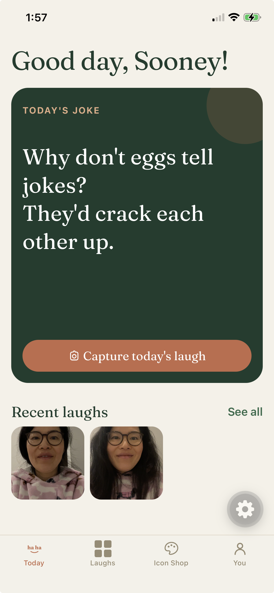
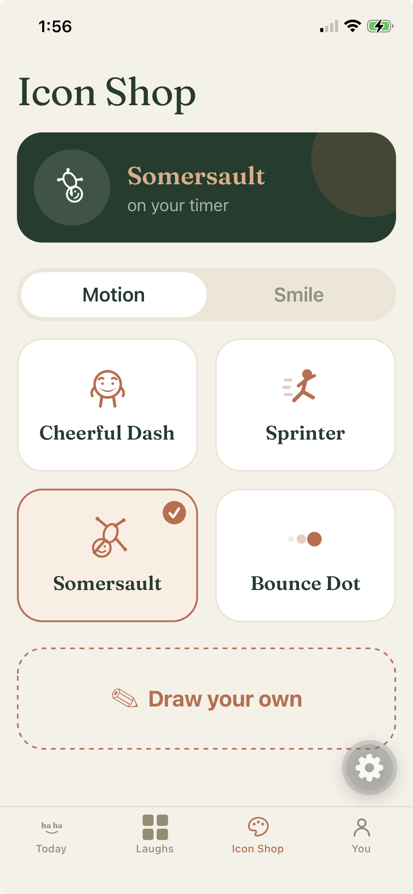
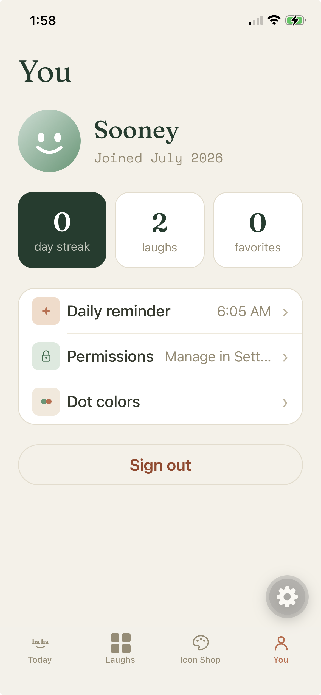

  

<h1 align="center">Laugh Selfie</h1>

<i>A daily ritual, not another habit tracker.</i>

---

## What it is

Laugh Selfie is a mobile app built around one simple daily action: record a short selfie video of yourself laughing. That's it. No feeds to scroll, no followers to chase — just a small, private ritual and a growing library of your own laughs.

The idea leans on something laughter research keeps circling back to: the physical act of laughing has real mood benefits even when it isn't triggered by something especially funny. So the app removes every point of friction between "I should do this" and "I did it" — one tap, a few seconds, done.

## Screenshots

  
  
  

## Features

- **Today** — a rotating joke to nudge things along, and a single tap to capture the day's laugh.
- **Laughs** — a visual timeline of every recording, grouped by month, with your longer/favorited laughs quietly highlighted.
- **Icon Shop** — the app's own icons (its loading motion, its record button) are yours to reskin — pick a preset or draw your own.
- **You** — streaks, a daily reminder, and your running stats.
- **Share** — send any recorded laugh straight to whatever platform you'd share it on.

## Design

The visual language is warm and editorial rather than clinical-tech — a cream and forest-green palette, a serif display face paired with a monospace accent, soft gradients instead of hard iconography. The goal was for the app to feel more like a keepsake object than a utility.

## Architecture, at a glance

- **Cross-platform mobile** app targeting iOS and Android from one codebase (Expo / React Native).
- **Local-first by design** — there's no account, no login, and no server. Your recordings are saved directly to your own device's photo library, and the app just keeps a lightweight index of dates and streaks alongside them. Your laughs stay yours.
- **On-device intelligence only** — the little touches (which laughs get highlighted, which caption suggests itself for a clip) are computed from data already on your device, not sent anywhere.

## Status

In active development, currently in private testing ahead of a wider release.

---

This repository is a project showcase — it intentionally doesn't include the app's source code.

